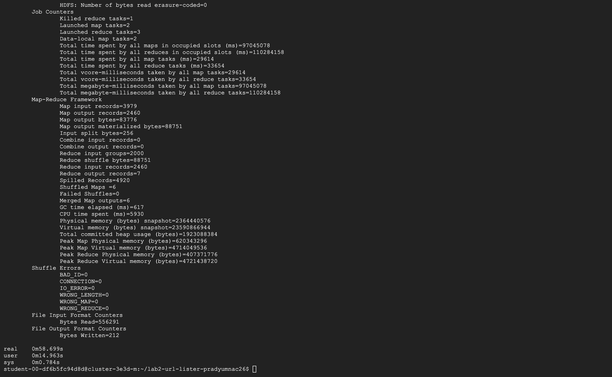
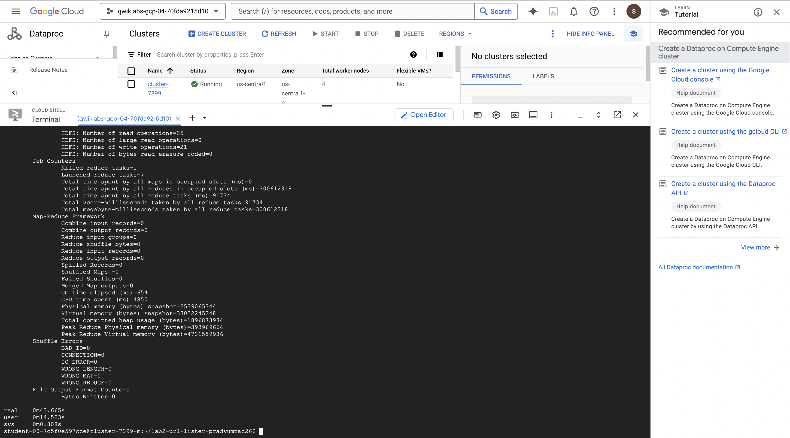
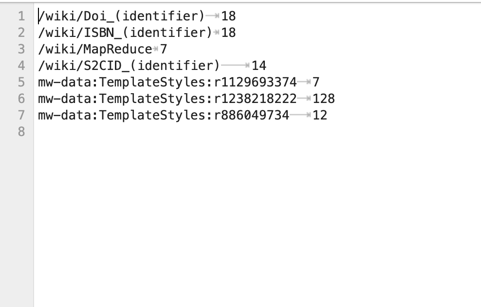

# URLCount Summary 

## How it Works

UrlCount is designed using the Hadoop's mapReduce framework to count the number of URLs from text data in articles/websites and then filters out the URLs that occur fewer than 5 times. We do this by slightly modifying the WordCount project where it counts the number of words present in the document or article. The basic idea is we find the links/URLS through href using regex regular expressions.

Basically it has 3 phases : 

- Mapper phase

  The Matcher processes each line of input to find all matching URLs using the Pattern class that matches href=\"[^\"]*\" for the href attribute and then updates the count of each URL to 1.
    
  

- Combiner phase

    A combiner can be used to optimize performance by reducing the amount of data transferred between the mapper and the reducer.

- Reducer phase

    The Reducer takes the input from the mapper/combiner and aggregates the count of URLs and filters URLs that occur less than 5 times.
  
## How it Runs

- Local
  
To run this we will need to install Java and Hadoop on our system. Since we did it on CSEL it has these pre-installed. We first run the Makefile using make command which will compile the Java code. The Make prepare command prepares the input directories for HDFS. Then make run command uses the hadoop command to submit the UrlCount job to the Hadoop cluster or local Hadoop setup.

- On Dataproc in Google Cloud Platform

1. SSH into the master node of your Google Cloud Dataproc cluster.
   
2. Clone the repository containing the UrlCount job.
   
3. Compile the code using the `make` command.
   
4. Upload the JAR file to HDFS and run the Hadoop job using the appropriate commands to count and filter URLs.


### **Instructions to Run the Hadoop Job on Google Cloud Platform**

#### 1. **SSH into the Dataproc Master Node**:
   Open your terminal and use the following command to SSH into the master node of your Dataproc cluster:
   ```bash
   gcloud compute ssh username@clustername-m --zone=availabilityzone
   ```
   Replace `username`, `clustername-m`, and `availabilityzone` with the appropriate values for your setup.

#### 2. **Clone Your Git Repository**:
   Clone the repository that contains your Hadoop job (you’ll need the GitHub username and access key):
   ```bash
   git clone https://github.com/username/repository.git
   ```
   After cloning, list the directory contents and navigate into the cloned folder:
   ```bash
   ls
   cd repository-folder
   ```

#### 3. **Run Make to Compile**:
   Inside the cloned repository, run the `make` command to compile the code:
   ```bash
   make
   ```

#### 4. **Prepare the Input Directory**:
   When you run the `make prepare` command, you may encounter an error indicating that the input directory is missing. To resolve this, first create the input directory in HDFS:
   ```bash
   hdfs dfs -mkdir -p /user/username/input
   ```
   Now, run `make prepare` again:
   ```bash
   make prepare
   ```

#### 5. **Fix the Version Error**:
   When you attempt to run `make run`, you might encounter a version error. To fix this, run the following commands to set up the correct Java classpath and compile the job:
   ```bash
   export HADOOP_CLASSPATH=$(hadoop classpath)
   javac -source 11 -target 11 -classpath $(hadoop classpath) -d ./ UrlCount.java
   jar cf UrlCount.jar -C ./classes .
   ```

#### 6. **Run the Hadoop Job**:
   Now, run the job with the `make run` command. It should work now:
   ```bash
   make run
   ```

#### 7. **Create a Directory for JARs in HDFS**:
   Next, create a directory in HDFS to store the JAR files:
   ```bash
   hdfs dfs -mkdir -p /user/username/jars
   ```

#### 8. **Upload the JAR File to HDFS**:
   Upload the `UrlCount.jar` file to HDFS:
   ```bash
   hdfs dfs -put UrlCount.jar /user/username/jars/UrlCount.jar
   ```

#### 9. **Run the Hadoop Job Using the JAR**:
   Execute the Hadoop job using the JAR file:
   ```bash
   hadoop jar UrlCount.jar UrlCount /user/username/input /user/username/output
   ```

#### 10. **Run the Job with Timing**:
   To time the execution of the Hadoop job, use the following command:
   ```bash
   time hadoop jar UrlCount.jar UrlCount /user/username/input /user/username/output
   ```

#### 11. **Remove Output Files Before Rerunning**:
   If you need to rerun the job, first remove the output files to avoid errors:
   ```bash
   hdfs dfs -rm -r /user/username/output
   ```

#### 12. **View the Output**:
   To see the content of the output file after running the job, use the following command:
   ```bash
   hdfs dfs -cat /user/username/output/part-00000
   ```

### **Important HDFS Paths**:
- The JAR file is placed in HDFS at:
   ```bash
   hdfs://clustername-m/user/username/jars/UrlCount.jar
   ```

## The Role of the Combiner
A **combiner** is an optional step in Hadoop that helps reduce data transfer between mappers and reducers by locally aggregating results.

## Issue in the UrlCount Job
In the **UrlCount** job, the reducer filters URLs that appear more than 5 times. If the **combiner** applies the same filtering logic, it may discard URLs prematurely. For example, if a URL appears 4 times on two different mappers, each combiner might discard it, though the total count should be 8.

## Conclusion
The **combiner** should only sum the counts and leave the filtering to the **reducer** to avoid data loss and ensure correct results.

# Hadoop Job Output and Inference

## Output from 2 Worker Nodes



### Inference:
- The Hadoop job ran with **2 worker nodes** and took around **58.7 seconds** to complete.
- The job processed **3979 map input records** and **2460 map output records**.
- The **user CPU time** was **14.96 seconds**, which shows a moderate utilization of resources in the cluster.
- This setup may take longer due to fewer worker nodes, leading to less parallelism.

---

## Output from 4 Worker Nodes



### Inference:
- The Hadoop job ran with **4 worker nodes** and completed in around **34.6 seconds**.
- The **user CPU time** was reduced to **12.45 seconds**, indicating better resource utilization due to the increased number of worker nodes.
- The reduced execution time shows that adding more worker nodes improves performance by distributing the workload more efficiently, achieving faster processing.

---

## General Inference:
- Comparing the results of the job executed on **2 worker nodes** and **4 worker nodes**, there is a noticeable improvement in performance with more nodes.
- **4 worker nodes** completed the job approximately **40% faster** than the 2-node setup, highlighting the advantage of parallel processing.
- Increasing the number of nodes reduces the overall execution time, making the system more scalable and capable of handling larger workloads more efficiently.




  

